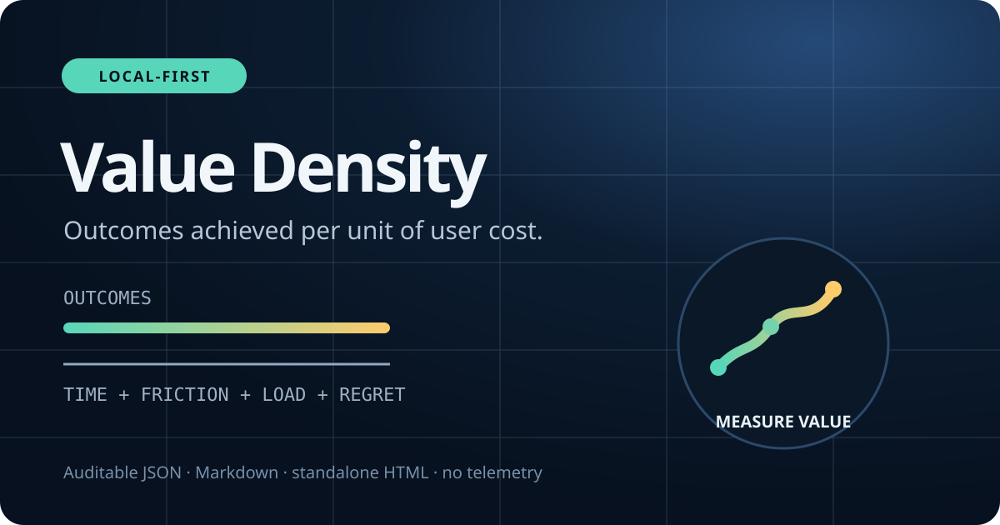
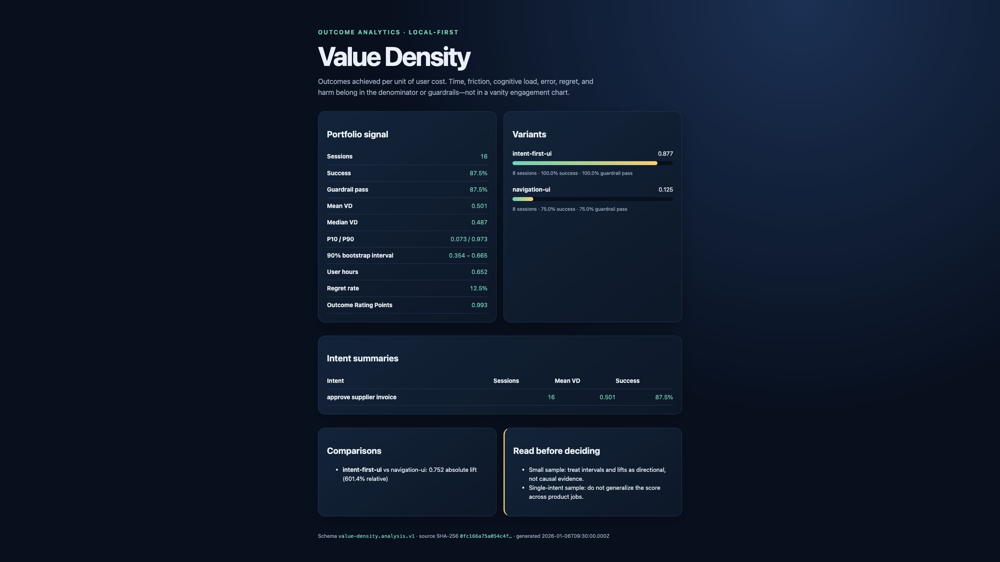
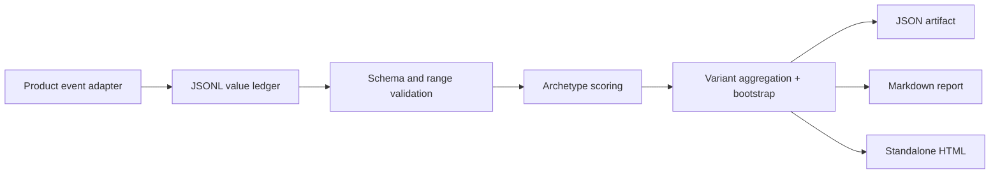

# Value Density Lab



Executable product analytics for a simple corrective idea: **success is outcomes achieved per unit of user cost**.

Value Density Lab turns local, privacy-preserving session events into auditable JSON, Markdown, and single-file HTML reports. It treats time, friction, cognitive load, error, regret, and harm as costs or guardrails—not vanity engagement wins.

This repository operationalizes the [Value Density framework published by Dr. Nripanka Das](https://www.linkedin.com/pulse/beyond-attention-economy-value-density-framework-digital-das-5wiqc). It is an original reference implementation, not a universal product score or a causal-inference shortcut.

## What you can prove in 60 seconds

```bash
git clone https://github.com/nripankadas07/value-density-lab
cd value-density-lab
npm install
npm test
npm run demo
open .demo/index.html
```

The deterministic demo compares a navigation-heavy invoice flow with an intent-first interface. It writes:

```text
.demo/
  sessions.jsonl     # privacy-safe value event ledger
  analysis.json      # versioned machine-readable artifact
  report.md          # review/PR summary
  index.html         # standalone visual report
```

All demo events are synthetic and clearly tagged. No analytics SDK, account, API key, network service, cookie, or LLM is involved.



## Why this is different

Conventional analytics can label a slow, confusing workflow as “high engagement.” Value Density Lab asks whether the user achieved the intended outcome, at what quality, and at what cost.

The engine includes:

- a stable `value-density.session.v1` JSONL event contract;
- general, utility/SaaS, entertainment, and education scoring models;
- explicit regret and harm guardrails;
- per-intent, archetype, and experiment-variant summaries;
- deterministic bootstrap intervals and control/treatment lift;
- Outcome Rating Points (`reach × attention quality × outcome lift`);
- input hashing and honest small-sample warnings;
- HTML escaping for untrusted event labels.

## CLI

```bash
# Validate an event ledger
node dist/src/cli.js validate examples/sessions.jsonl

# Build a report
node dist/src/cli.js analyze examples/sessions.jsonl --out report

# Compare experiment variants
node dist/src/cli.js compare examples/sessions.jsonl \
  --control navigation-ui \
  --treatment intent-first-ui \
  --out report
```

After `npm link`, use the `value-density` command directly.

## Event contract

Each line represents one intent-bearing session:

```json
{
  "schemaVersion": "value-density.session.v1",
  "id": "invoice-treatment-1",
  "timestamp": "2026-01-06T09:01:00.000Z",
  "intent": "approve supplier invoice",
  "archetype": "utility",
  "variant": "intent-first-ui",
  "userHash": "rotating-pseudonym",
  "outcome": { "achieved": true, "quality": 0.96, "weight": 0.9, "value": 1 },
  "cost": { "seconds": 61, "friction": 0.12, "cognitiveLoad": 0.18, "errors": 0 },
  "guardrails": { "satisfaction": 0.9, "regret": 0.04, "harm": 0 }
}
```

Scores are only comparable when teams use the same intent taxonomy, weights, collection method, and archetype. The raw components remain in the artifact so reviewers can challenge the model.

## Architecture



Read [the architecture](docs/architecture.md), [measurement notes](docs/measurement.md), and [limitations](docs/limitations.md) before using a score in a decision.

## Evidence, not claims

`npm test` covers exact schema fields, serialization-safe weights, strict CLI options, malformed JSONL, duplicate identities, finite-math/overflow guards, locale-independent analysis, per-intent summaries, experiment lift, terminal controls, and Markdown/HTML injection. CI rebuilds the package, runs the suite, validates the checked-in example, and executes the demo.

## Non-goals

- It does not infer intent from clicks.
- It does not claim an observational lift is causal.
- It does not rank unrelated products with one magic number.
- It does not send telemetry or require user-level identifiers.
- It does not replace qualitative research, accessibility testing, or harm review.

## Status

`0.1.0` is a research-quality executable specification. The event and analysis schemas are versioned; scoring weights and collection guidance should be governed by each product team.

MIT licensed. Contributions that add falsifiable examples, adapters, or guardrail checks are welcome.

See the [roadmap](ROADMAP.md), [research provenance](docs/research.md), and [AI-assistance disclosure](AI_ASSISTED.md).
